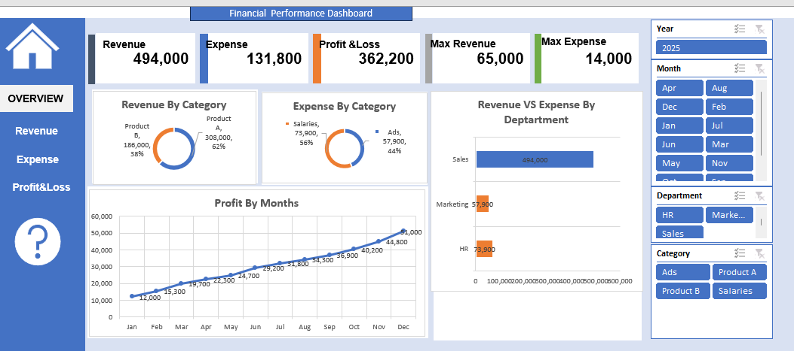

# Excel-Finance-Performance-Dashboard
Interactive Finance Performance Dashboard built in Microsoft Excel using Pivot Tables, Charts, and Slicers.

## Overview

This project presents an interactive Finance Performance Dashboard developed in Microsoft Excel.

The dashboard enables users to analyze revenue, expenses, and profit performance through dynamic slicers and visualizations.

## Dashboard Preview

## Key Metrics

- Total Revenue: 494,000
- Total Expense: 131,800
- Total Profit: 362,200
- Maximum Revenue: 65,000
- Maximum Expense: 14,000

## Features

- Interactive Year Filter
- Monthly Analysis
- Department Analysis
- Category Analysis
- Revenue vs Expense Comparison
- Profit Trend by Month
- Dynamic Pivot Charts
- Slicers for easy navigation

## Tools Used

- Microsoft Excel
- Pivot Tables
- Pivot Charts
- Slicers
- Dashboard Design

## Insights

- Product A contributes the highest revenue share.
- Salaries account for the largest expense category.
- Revenue significantly exceeds expenses across departments.
- Profit shows consistent growth throughout the year.

## Author

Catetasker
